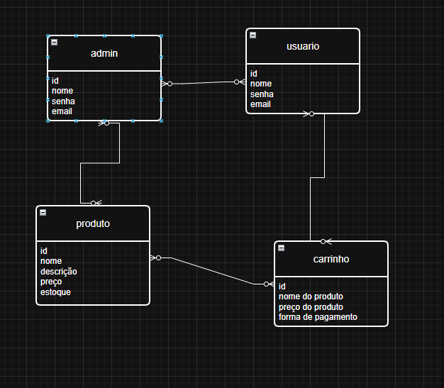

# Vival Vinis

Projeto Final 2025 do Curso Técnico Integrado de Desenvolvimento de Sistemas - Colégio Pedro II - Campus Duque de Caxias

**Integrantes:**
 - Ana Luiza Moutinho
 - Victor de Medeiros Barbosa
 - Victória Pimentel do Sacramento
 - Vitória Pessanha Macena

 ## Tecnologias

Este projeto é desenvolvido utilizando  para desenvolvimento da API de backend, SvelteKit como framework frontend e Tailwind como framework CSS.

Em termos de arquitetura de software, este projeto é composto por duas aplicações:
- API/Backend desenvolvida em Node.js com Express
- Aplicação Frontend desenvolvida com Svelte e estilizada com Tailwind

A Aplicação frontend realiza requisições à API utilizando os verbos HTTP, que por sua vez retorna as informações a serem tratadas pela interface. Todo envio e rebimento de informações entre as duas aplicações é realizada utilizando o formato JSON.

Para detalhes técnicos de como executar o projeto consulte o [README da API](src/api/README.md) e [README da Aplicação Frontend](src/frontend-app/README.md). 

## Descrição do Projeto

Vival Vinis é uma loja virtual de discos de vinil criada por quatro jovens programadores com o objetivo de unir tecnologia, cultura e música brasileira. Apaixonados por som analógico e movidos pela vontade de valorizar a produção nacional, o grupo desenvolveu uma plataforma simples, intuitiva e voltada para quem busca mais do que apenas colecionar: viver a música com autenticidade.

O catálogo da loja é cuidadosamente selecionado, com foco em dois pilares da nossa identidade musical — MPB e rock nacional. De clássicos atemporais a raridades desejadas por colecionadores, a Vival Vinis oferece uma experiência que celebra o passado com os olhos no presente. Mais do que uma loja, é um tributo à riqueza sonora do Brasil.

## Documentação

- [Manual do Usuário](manual.md)
- [Requisitos](requisitos.md)
- [Casos de Uso](casos-de-uso.md)
- [Apresentação](apresentacao.pdf)

**Modelagem do Banco de Dados**

